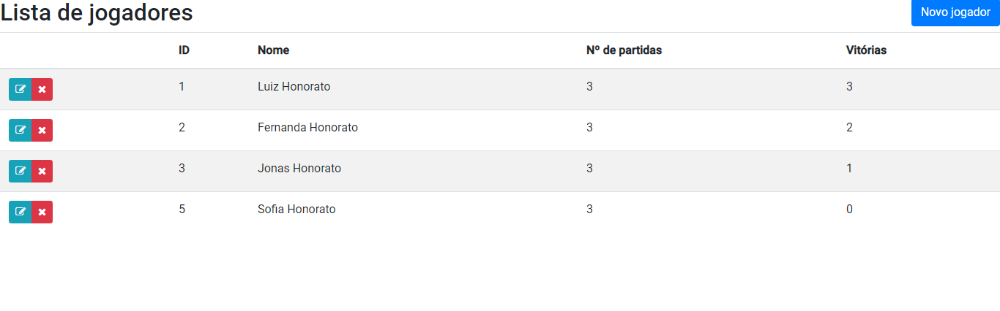

# Introdução

Esse aplicativo tem a finalidade de cadastrar produtos e adicioná-los a um carrinho de compras.

# Sobre o build

O app foi criado com a utilização das seguintes ferramentas:

Para o backend:
- Spring Boot
- Java 8;
- Mockito (TDD)
- MySQL;

Para o frontend:
- Angular 8;
- Bootstrap;

# Preparação do ambiente

Para executar o aplicativo é necessário instalar o banco de dados MySQL. Para isso siga os seguintes passos:

- Faça o download do MySQL Community Server versão 8.0 (arquivo .msi executável ou .zip compactado) encontrado no link https://dev.mysql.com/downloads/installer/;
- Instale o executável em seu dispositivo;
- Execute as etapas de configuração do SETUP do MySQL;

# Execução

# Screenshots

