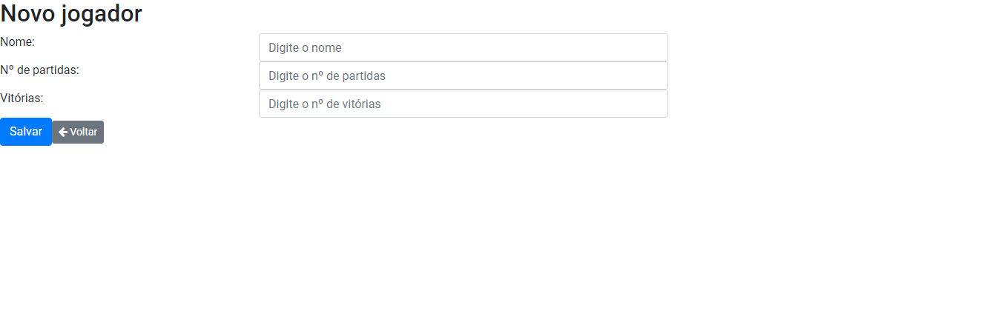
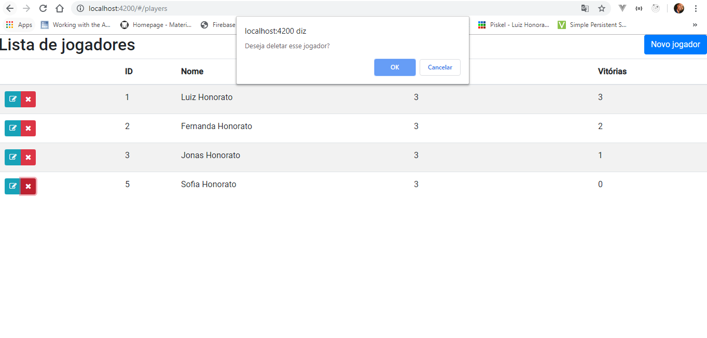

# Introdução

Esta aplicação tem por objetivo cadastrar o ranking de jogadores em N modalidades de jogos.

# Sobre o build

O app foi criado com a utilização das seguintes ferramentas:

Para o backend:
- Spring Boot
- Java 8;
- Mockito
- MySQL;
- Intellij IDEA;
- MySQL Workbench;

Para o frontend:
- Angular 8;
- Bootstrap;
- Visual Studio Code;

# Preparação do ambiente

Para executar o aplicativo é necessário instalar o banco de dados MySQL. Para isso siga os seguintes passos:

- Faça o download do MySQL Community Server versão 8.0 (arquivo .msi executável ou .zip compactado) encontrado no link https://dev.mysql.com/downloads/installer/;
- Instale o executável em seu dispositivo;
- Execute as etapas de configuração do SETUP do MySQL;
- Abra o MySQL Workbench e crie uma nova base com o nome ranking_games;
- Abra uma aba de execução de SQL e execute o que conteúdo do arquivo create-ranking.sql que está na raíz deste repositório.

# Execução

Abra o terminal no seu computador e digite o seguinte comando:

- git clone https://github.com/LuizHonorato/ranking-games.git

- Na IDE de sua preferência abra a pasta ranking_games;

- Para rodar todos os testes de uma vez clique com o botão direito no package com.jogos.ranking dentro do package test e clique em Run Tests;

- Caso deseje executar os testes em cada classe, clique em cada uma delas separadamente com o botão direito e clique em Run <nomeDaClasse>;

- Após executar os testes, execute a aplicação principal, a API estará rodando no endereço http://localhost:8080;

- Abra uma nova aba no seu terminal e navegue até a pasta ranking-games-frontend baixada deste repositório;

- No terminal rode o comando npm i (É necessário ter o Node e o npm instalados no computador);

- Após todas as dependências serem instaladas, execute o comando: ng serve;

- A aplicação frontend estará rodando no endereço http://localhost:4200;

# Screenshots

